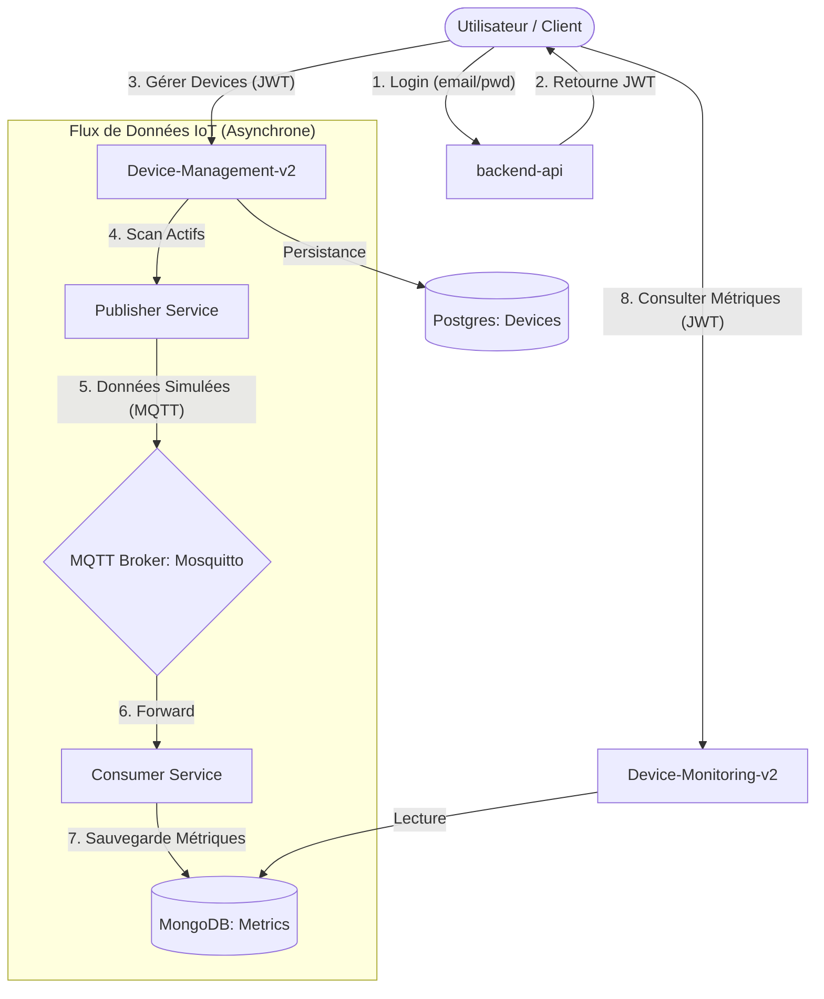

# Architecture du Projet Cloud Security IoT

Ce document explique le fonctionnement des trois microservices du projet et leurs interactions.

## 1. Vue d'Ensemble

L'architecture repose sur trois piliers : l'**Authentification** (Centralisé), la **Gestion** (Producteur de données) et le **Monitoring** (Consommateur de données).

---

## 2. Les Microservices

### 🔐 backend-api

- **Technologie**: FastAPI + SQLAlchemy (PostgreSQL).
- **Responsabilité**: Gestion des utilisateurs et de la sécurité.
- **Points clés**:
  - Fournit les endpoints `/users/add` (inscription) et `/users/auth` (connexion).
  - Génère des tokens JWT signés avec une clé secrète partagée.
  - Gère une "Blacklist" pour les déconnexions sécurisées.

### 🛠️ device-management-v2

- **Technologie**: FastAPI + SQLAlchemy (PostgreSQL) + Paho-MQTT.
- **Responsabilité**: Inventaire des équipements et simulation de trafic.
- **Fonctionnement**:
  - Permet de déclarer de nouveaux devices (température, humidité, etc.).
  - **Service de Publication**: Une boucle (`mqtt_publisher_service.py`) parcourt les devices actifs toutes les 30 secondes pour envoyer une valeur réaliste vers le broker MQTT.
  - Le topic utilisé suit généralement le format : `cloud-security-iot/device/{id}`.

### 📊 device-monitoring-v2

- **Technologie**: FastAPI + PyMongo (MongoDB) + Paho-MQTT.
- **Responsabilité**: Collecte historique et restitution des données.
- **Fonctionnement**:
  - **Service de Consommation**: `mqtt_consumer.py` reste connecté au broker et s'abonne à `cloud-security-iot/#`.
  - Chaque message reçu est stocké dans MongoDB en tant que "Métrique".
  - Fournit une API pour récupérer les dernières données ou l'historique complet pour un dashboard.

---

## 3. Le "Va-et-Vient" (Interactions)

| Flux            | Type              | Description                                                                                                          |
| :-------------- | :---------------- | :------------------------------------------------------------------------------------------------------------------- |
| **Sécurité**    | Partage de Secret | Tous les services utilisent la même `SECRET_KEY` pour valider les tokens sans avoir à ré-interroger le service Auth. |
| **Données**     | MQTT (Pub/Sub)    | `Device Management` pousse les données. `Device Monitoring` les récapitule. C'est un couplage faible (asynchrone).   |
| **Utilisateur** | REST API          | L'utilisateur interagit avec les trois APIs via des requêtes HTTP classiques, portant son JWT.                       |

## 4. Comment reproduire / étendre ?

1.  **Ajouter un capteur**: Déclarez-le dans `Device-Management`. Le Publisher s'occupera automatiquement d'envoyer des données s'il connaît le type de capteur.
2.  **Ajouter un traitement**: Créez un nouveau microservice qui s'abonne aux mêmes topics MQTT pour faire de l'IA ou de l'alerte en temps réel.
3.  **Bases de données**:
    - Utilisez **Postgres** pour les données structurées et relationnelles (Users, Device Config).
    - Utilisez **MongoDB** pour les données volumineuses et temporelles (Métriques).
